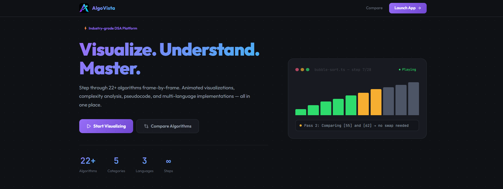
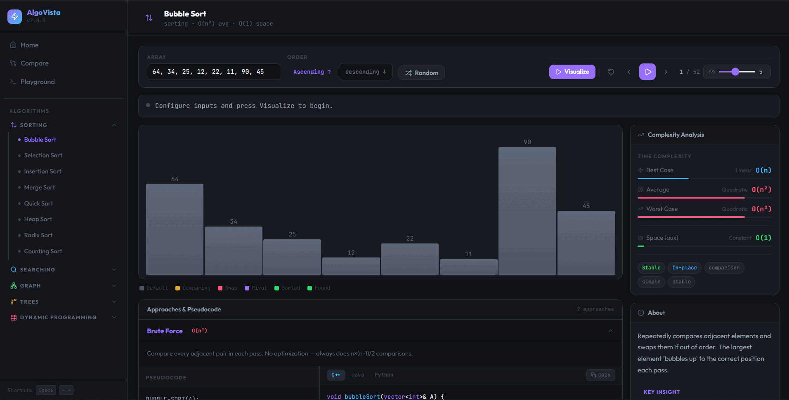

<div align="center">

# ⚡ AlgoVista

### An interactive DSA visualization platform built with Next.js 15, TypeScript, Zustand, D3.js, and Framer Motion.

[](https://dsa-visualization-ten.vercel.app/)
[](https://nextjs.org/)
[](https://www.typescriptlang.org/)
[](./LICENSE)

[Live Demo](#) · [Architecture](#architecture) · [Features](#features) · [Setup](#setup)

</div>

---

<!-- 
  ╔══════════════════════════════════════════════════════════╗
  ║  SCREENSHOT PLACEHOLDER — Hero Section                   ║
  ║  Replace the line below with your actual screenshot:     ║
  ║  ║
  ╚══════════════════════════════════════════════════════════╝
-->

> 📸 **[ADD HERO SCREENSHOT HERE]**
> Capture the full home page and save as `public/assets/screenshots/hero.png`
> Then replace this block with: ``

---

## Why AlgoVista?

Most DSA visualizers tightly couple algorithm execution logic with rendering code — making them hard to extend, maintain, or test.

AlgoVista separates these concerns completely:

| Layer | Responsibility |
|---|---|
| **Algorithm Engine** | Pure TypeScript functions that emit visualization steps — zero DOM coupling |
| **Playback Engine** | Zustand store that manages step index, speed, and play/pause state |
| **Visualization Layer** | D3.js and React components that only *read* the current step |
| **Interaction Layer** | Controls, keyboard shortcuts, and UI — fully decoupled from algorithm logic |

This architecture makes every algorithm unit-testable, replayable frame-by-frame, and trivially extensible.

---

## Features

### 🎬 Visualization Engine
- **Step-based execution pipeline** — every algorithm emits typed steps, consumed by the playback engine
- **D3.js graph rendering** — interactive SVG graphs with nodes, weighted edges, and arrowheads
- **Tree visualizations** — animated BST with computed layout for any number of nodes
- **DP table animations** — cell-by-cell filling with dependency highlighting
- **Animated bar charts** — Framer Motion layout animations for sorting visualizations

### ▶️ Playback Controls
- Play / Pause / Step Forward / Step Backward
- Speed control (1×–10×) via slider
- Reset to initial state
- Progress bar showing current step position
- **Keyboard shortcuts**: `Space` (play/pause), `← →` (step), `R` (reset), `+ -` (speed)

### 📚 Learning Features
- **Pseudocode** for every algorithm — language-agnostic, clean, readable
- **Multi-approach implementations** — Brute Force → Better → Optimal for each algorithm
- **3 languages**: C++, Java, Python with proper syntax highlighting
- **Comparison mode** — run two algorithms simultaneously on the same input
- **Complexity insights** — best/average/worst time + space with visual bars
- **Interactive playground** — quick sandbox for any array algorithm

### ✨ UX Features
- Keyboard shortcuts for all playback controls
- Fully responsive — works on mobile, tablet, and desktop
- Dark engineering aesthetic
- Smooth Framer Motion animations throughout
- Collapsible mobile sidebar with hamburger menu

---

## Visualizations

<!-- 
  ╔══════════════════════════════════════════════════════════════════╗
  ║  GIF PLACEHOLDER — Sorting Visualization                         ║
  ║  Record a GIF of bubble/merge sort and save as:                  ║
  ║  public/assets/screenshots/sorting-viz.gif                       ║
  ║  Then replace this block with:                                   ║
  ║           ║
  ╚══════════════════════════════════════════════════════════════════╝
-->

### Sorting Algorithms
> 🎬 **[ADD SORTING GIF HERE]** — `public/assets/screenshots/sorting-viz.gif`

---

### Graph Traversal (BFS / DFS / Dijkstra)
> 🎬 **[ADD GRAPH GIF HERE]** — `public/assets/screenshots/graph-traversal.gif`

---

### Pseudocode + Multi-language Code Panel
> 📸 **[ADD PSEUDOCODE SCREENSHOT HERE]** — `public/assets/screenshots/pseudocode-panel.png`

---

### Algorithm Comparison Mode
> 📸 **[ADD COMPARISON SCREENSHOT HERE]** — `public/assets/screenshots/comparison-mode.png`

---

### Dynamic Programming Table
> 🎬 **[ADD DP TABLE GIF HERE]** — `public/assets/screenshots/dp-table.gif`

---

### Mobile View
> 📸 **[ADD MOBILE SCREENSHOT HERE]** — `public/assets/screenshots/mobile-view.png`

---

## Algorithms (22+)

### Sorting
| Algorithm | Time (avg) | Space | Stable |
|---|---|---|---|
| Bubble Sort | O(n²) | O(1) | ✅ |
| Selection Sort | O(n²) | O(1) | ❌ |
| Insertion Sort | O(n²) | O(1) | ✅ |
| Merge Sort | O(n log n) | O(n) | ✅ |
| Quick Sort | O(n log n) | O(log n) | ❌ |
| Heap Sort | O(n log n) | O(1) | ❌ |
| Radix Sort | O(nk) | O(n+k) | ✅ |
| Counting Sort | O(n+k) | O(k) | ✅ |

### Searching
| Algorithm | Time | Notes |
|---|---|---|
| Linear Search | O(n) | Works on unsorted data |
| Binary Search | O(log n) | Requires sorted input |
| Jump Search | O(√n) | Requires sorted input |

### Graph
| Algorithm | Time | Use Case |
|---|---|---|
| BFS | O(V+E) | Shortest path (unweighted) |
| DFS | O(V+E) | Cycle detection, components |
| Dijkstra's | O((V+E) log V) | Shortest path (weighted) |
| Kruskal's MST | O(E log E) | Minimum spanning tree |
| Topological Sort | O(V+E) | Task scheduling, DAGs |

### Dynamic Programming
| Algorithm | Time | Space |
|---|---|---|
| Fibonacci | O(n) | O(n) |
| LCS | O(mn) | O(mn) |
| 0/1 Knapsack | O(nW) | O(nW) |
| Edit Distance | O(mn) | O(mn) |

### Trees
| Algorithm | Time | Notes |
|---|---|---|
| BST Insert/Search | O(log n) avg | O(n) worst |
| Inorder Traversal | O(n) | Produces sorted output for BST |
| Preorder Traversal | O(n) | Tree serialization |
| Postorder Traversal | O(n) | Tree deletion, expression eval |

---

## Tech Stack

| Layer | Technology | Why |
|---|---|---|
| Framework | **Next.js 15** (App Router) | File-based routing, RSC, Vercel-optimized |
| Language | **TypeScript** | Full type safety, self-documenting code |
| State Management | **Zustand** | Minimal boilerplate, selective re-renders |
| Graph Visualization | **D3.js** | Precise SVG control for graphs and trees |
| Animations | **Framer Motion** | Layout animations, spring physics |
| Styling | **Tailwind CSS v4** | Utility-first with CSS-native `@theme` |
| Deployment | **Vercel** | Zero-config Next.js deployment |

---

## Architecture

```
User Interaction (keyboard / click)
          │
          ▼
Playback Engine (Zustand Store)
  ┌───────────────────────────────┐
  │ playbackState: idle/playing/  │
  │   paused/finished             │
  │ currentStep: number           │
  │ speed: 1-10                   │
  │ _tickerId: setInterval ref    │
  └───────────┬───────────────────┘
              │ reads steps[currentStep]
              ▼
Algorithm Step Engine (Pure TypeScript)
  ┌─────────────────────────────────┐
  │ bubbleSortSteps(arr) → Step[]   │
  │ dijkstraSteps(graph) → Step[]   │
  │ lcsSteps(s1, s2)   → Step[]    │
  │ Zero DOM · Zero React           │
  └──────────────┬──────────────────┘
                 │ steps consumed by
                 ▼
Visualizer Components
  ┌──────────────────────────────────┐
  │ ArrayVisualizer  → bar chart     │
  │ GraphVisualizer  → D3.js SVG     │
  │ DPTableVisualizer→ animated grid │
  │ TreeVisualizer   → D3.js SVG     │
  └──────────────────────────────────┘
```

### The Step-Emitter Pattern

Every algorithm is implemented as a **pure function** that returns a typed `Step[]` array:

```typescript
// src/algorithms/sorting/bubbleSort.ts
export function bubbleSortSteps(arr: number[]): ArrayStep[] {
  const steps: ArrayStep[] = [];
  // Pure computation — no DOM, no React, no side effects
  steps.push({
    type: "compare",
    array: [...arr],
    indices: [j, j + 1],
    description: `Comparing ${arr[j]} and ${arr[j+1]}`
  });
  return steps;
}
```

**Why this matters:**
- ✅ **Testable** — `bubbleSortSteps([3,1,2])` returns exact steps, no browser needed
- ✅ **Replayable** — step backward = `currentStep - 1` (O(1), no re-computation)
- ✅ **Speed-independent** — changing speed doesn't affect algorithm logic
- ✅ **Extensible** — add a new algorithm by adding one file + one registry entry

---

## Folder Structure

```
src/
├── algorithms/              # Pure step-emitter functions — zero DOM coupling
│   ├── sorting/             # bubbleSort.ts, selectionSort.ts, index.ts, ...
│   ├── searching/           # linearSearch, binarySearch, jumpSearch
│   ├── graph/               # BFS, DFS, Dijkstra, Kruskal, TopoSort
│   ├── dp/                  # Fibonacci, LCS, Knapsack, EditDistance
│   └── trees/               # BST insert/search, traversals, layout
│
├── app/                     # Next.js App Router
│   ├── page.tsx             # Landing page
│   ├── compare/             # Side-by-side algorithm comparison
│   ├── playground/          # Quick algorithm sandbox
│   └── visualizer/
│       ├── layout.tsx       # Shared sidebar + main layout
│       ├── sorting/[algorithm]/
│       ├── searching/[algorithm]/
│       ├── graph/[algorithm]/
│       ├── dp/[algorithm]/
│       └── trees/[algorithm]/
│
├── components/
│   ├── layout/              # Sidebar (with mobile hamburger)
│   ├── ui/                  # Button, Badge, Card, Skeleton, Tooltip
│   ├── visualizers/
│   │   ├── sorting/         # ArrayVisualizer (animated bar chart)
│   │   ├── graph/           # GraphVisualizer (D3.js SVG)
│   │   ├── dp/              # DPTableVisualizer, FibonacciTable
│   │   └── trees/           # TreeVisualizer (D3.js SVG)
│   ├── controls/            # PlaybackBar (play/pause/step/speed)
│   ├── panels/
│   │   ├── ComplexityPanel.tsx   # Time/space complexity with bars
│   │   ├── DescriptionPanel.tsx  # Algorithm description + use cases
│   │   └── PseudocodePanel.tsx   # Pseudocode + C++/Java/Python code
│   └── shared/              # StepDescriptionBar
│
├── stores/
│   └── visualizerStore.ts   # Zustand store — entire playback engine
│
├── hooks/
│   └── useVisualizer.ts     # usePlaybackControls, keyboard shortcuts, step selectors
│
├── data/
│   └── pseudocode.ts        # All pseudocode + multi-approach implementations
│
├── lib/
│   ├── utils.ts             # cn(), color constants (C object)
│   └── highlighter.ts       # Inline syntax highlighter (no external deps)
│
├── constants/
│   └── index.ts             # ALGORITHM_REGISTRY, CATEGORY_CONFIG, speeds
│
├── types/
│   └── index.ts             # All TypeScript domain types
│
├── utils/
│   └── index.ts             # generateRandomArray, parseArrayInput, etc.
│
└── styles/
    (CSS is in app/globals.css — Tailwind v4 @theme pattern)

public/
├── favicon.svg              # SVG favicon
├── og-image.svg             # Open Graph image
└── assets/
    ├── logo/                # ← PUT YOUR LOGO FILES HERE
    │   └── README.md        # Instructions for logo files
    └── screenshots/         # ← PUT YOUR SCREENSHOTS/GIFs HERE
        └── README.md        # Instructions for screenshots
```

---

## Engineering Decisions

### Why Zustand over Redux or Context API?

Redux requires actions, reducers, and dispatchers — massive boilerplate for a playback engine. Context API re-renders every consumer on every state change. Zustand allows **selective subscriptions**:

```typescript
// Only re-renders when speed changes — not when currentStep changes
const speed = useVisualizerStore(s => s.speed);
```

The playback ticker is also managed inside the store (`setInterval` / `clearInterval`), keeping all timing logic in one place.

### Why D3.js over plain React SVG?

D3 gives precise control over SVG geometry — node positions, edge paths, arrowhead markers, and zoom/pan. React's virtual DOM is not designed for this level of fine-grained SVG manipulation. AlgoVista uses D3 for rendering (via `useRef`) and React for component lifecycle.

### Why Step Emitters?

Separating execution from rendering enables:
1. **Replayable animations** — step backward = decrement an index
2. **Testable algorithms** — pure functions, no browser needed
3. **Scalable pipeline** — add any algorithm without touching the UI

### Why Tailwind v4?

Tailwind v4 uses a **CSS-native `@theme {}` block** instead of `tailwind.config.js`. This co-locates design tokens with CSS, enables faster builds via the Rust-based Oxide engine, and removes the need for a separate config file.

---

## Challenges

- **Synchronizing playback with Framer Motion animations** — solved by keeping all timing in the Zustand ticker and using `layout` prop for position-independent animations
- **Keyboard shortcuts with stale closures** — solved with a `useRef` pattern so the event handler always reads fresh state without re-registering
- **Tailwind v4 breaking change** — v4 ignores `tailwind.config.ts` entirely; migrated to CSS `@theme {}` and inline style objects
- **DP table overflow on mobile** — wrapped in horizontal scroll containers with touch-friendly scrolling
- **Sidebar on mobile** — implemented collapsible overlay sidebar with Framer Motion slide animation

---

## Setup

```bash
# Clone the repository
git clone https://github.com/garvg4278/DSA_Visualization.git
cd DSA_Visualization

# Install dependencies
npm install

# Start development server
npm run dev
# → http://localhost:3000

# Production build
npm run build && npm start
```

> **No database or environment variables required.** Runs instantly.

---

## Deployment

### Deploy to Vercel (Recommended)

```bash
npm install -g vercel
vercel
```

Or connect your GitHub repo at [vercel.com](https://vercel.com) for automatic deployments on push.

**Live:** https://dsa-visualization-ten.vercel.app/

---

## Adding a New Algorithm

1. Create `src/algorithms/<category>/yourAlgo.ts` — export a `yourAlgoSteps()` function
2. Add metadata to `ALGORITHM_REGISTRY` in `src/constants/index.ts`
3. Add pseudocode + implementations to `src/data/pseudocode.ts`
4. Wire into the category page in `src/app/visualizer/<category>/[algorithm]/page.tsx`

The entire playback, keyboard, and UI system works automatically.

---

## Legacy Version

The original implementation (Express.js + EJS + MongoDB) is preserved in the `legacy-v1` branch.

The current version is a **complete architectural rebuild** using modern frontend engineering practices — TypeScript, Next.js App Router, Zustand, D3.js, and Framer Motion.

---

## Future Scope

- [ ] **Benchmarking mode** — run algorithms on large datasets and compare timing
- [ ] **Custom graph editor** — drag-and-drop to build your own graph
- [ ] **AVL Tree / Red-Black Tree** visualizations with balancing animations
- [ ] **LeetCode integration** — link each algorithm to related problems
- [ ] **WebAssembly** — run algorithm benchmarks at near-native speed
- [ ] **Collaborative classrooms** — shareable visualizer sessions

---

## License

MIT — free to use for portfolios, education, and projects.

---

<div align="center">

Built with ⚡ by [Garv Gupta](https://github.com/garvg4278)

**Stack:** Next.js 15 · TypeScript · Tailwind CSS v4 · Zustand · D3.js · Framer Motion

</div>
